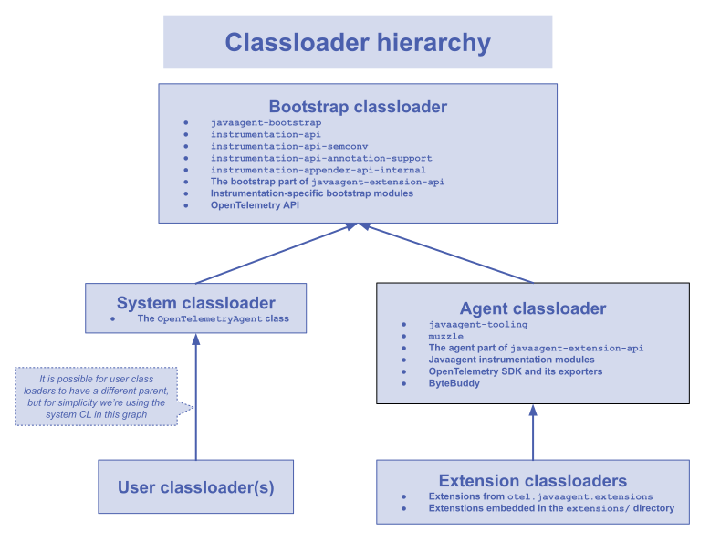

# Javaagent structure

The javaagent can be logically divided into several parts, based on the class loader that contains
particular classes (and resources) in the runtime:

* The main agent class living in the system class loader.
* Classes that live in the bootstrap class loader.
* Classes that live in the agent class loader.
* Javaagent extensions, and the extension class loader(s).

## System class loader

The only class that is loaded by the system class loader is the
`io.opentelemetry.javaagent.OpenTelemetryAgent` class. This is the main class of the javaagent, it
implements the
[Java instrumentation agent specification](https://docs.oracle.com/javase/8/docs/api/java/lang/instrument/package-summary.html).
This class is loaded during application startup by the system class loader. Its sole
responsibility is to push the agent's classes into JVM's bootstrap class loader and immediately
delegate to the `io.opentelemetry.javaagent.bootstrap.AgentInitializer` class, living in the
bootstrap class loader.

Inside the javaagent jar, this class is located in the `io/opentelemetry/javaagent/` directory.

## Bootstrap class loader

The bootstrap class loader contains several modules:

* **The `javaagent-bootstrap` module**:
  it contains classes that continue the initialization work started by `OpenTelemetryAgent`, as well
  as some internal javaagent classes and interfaces that must be globally available to the whole
  application. This module is internal and its APIs are considered unstable.
* **The `instrumentation-api` and `instrumentation-api-semconv` modules**:
  these modules contain the [Instrumenter API](using-instrumenter-api.md) and other related
  utilities. Because they are used by almost all instrumentations, they must be globally available
  to all classloaders running within the instrumented application. The classes located in these
  modules are used by both javaagent and library instrumentations - they all must be usable even
  without the javaagent present.
* **The `instrumentation-annotations-support` module**:
  it contains classes that provide support for annotation-based auto-instrumentation, e.g.
  the `@WithSpan` annotation. This module is internal and its APIs are considered unstable.
* **The `instrumentation-appender-api-internal` module**:
  it contains classes that constitute the "appender API", used by logging instrumentations. This
  module is internal and its APIs are considered unstable.
* **The `io.opentelemetry.javaagent.bootstrap` package from the `javaagent-extension-api` module**:
  this package contains several instrumentation utilities that are only usable when an application
  is instrumented with the javaagent; for example, the `Java8BytecodeBridge` that should be used
  inside advice classes.
* All modules using the `otel.javaagent-bootstrap` Gradle plugin:
  these modules contain instrumentation-specific classes that must be globally available in the
  bootstrap class loader. For example, classes that are used to coordinate
  different `InstrumentationModule`s, like the common utilities for storing Servlet context path, or
  the thread local switch used to coordinate different Kafka consumer instrumentations. By
  convention, all these modules are named according to this
  pattern: `:instrumentation:...:bootstrap`.
* The [OpenTelemetry API](https://github.com/open-telemetry/opentelemetry-java/tree/main/api/all).

Inside the javaagent jar, these classes are all located under the `io/opentelemetry/javaagent/`
directory. Aside from the javaagent-specific `javaagent-bootstrap` and `javaagent-extension-api`
modules, all other modules are relocated and placed under the `io/opentelemetry/javaagent/shaded/`
directory. This is done to avoid conflicts with the application code, which may contain different
versions of some of our APIs (`opentelemetry-api`, `instrumentation-api`).

## Agent class loader

The agent class loader contains almost everything else not mentioned before, including:

* **The `javaagent-tooling` module**:
  this module picks up the initialization process started by `OpenTelemetryAgent`
  and `javaagent-bootstrap` and actually finishes the work, starting up the OpenTelemetry SDK and
  building and installing the `ClassFileTransformer` in the JVM. The javaagent
  uses [ByteBuddy](https://bytebuddy.net) to configure and construct the `ClassFileTransformer`.
  This module is internal and its APIs are considered unstable.
* **The `muzzle` module**:
  it contains classes that are internally used by [muzzle](muzzle.md), our safety net feature. This
  module is internal and its APIs are considered unstable.
* **The `io.opentelemetry.javaagent.extension` package from the `javaagent-extension-api` module**:
  this package contains common extension points and SPIs that can be used to customize the agent
  behavior.
* All modules using the `otel.javaagent-instrumentation` Gradle plugin:
  these modules contain actual javaagent instrumentations. Almost all of them implement
  the `InstrumentationModule`, some of them include a library instrumentation as an `implementation`
  dependency. You can read more about writing instrumentations [here](writing-instrumentation.md).
  By convention, all these modules are named according to this
  pattern: `:instrumentation:...:javaagent`.
* The [OpenTelemetry SDK](https://github.com/open-telemetry/opentelemetry-java/tree/main/sdk/all),
  along with various exporters and SDK extensions.
* [ByteBuddy](https://bytebuddy.net).

Inside the javaagent jar, all classes and resources that are meant to be loaded by
the `AgentClassLoader` are placed inside the `inst/` directory. All Java class files have
the `.classdata` extension (instead of just `.class`) - this ensures that they will not be loaded by
general class loaders included with the application, making the javaagent internals completely
isolated from the application code.

If a javaagent instrumentation includes a library instrumentation as an `implementation` dependency,
that dependency is shaded to prevent conflicts with application code (which may or may not include
the same library classes in different version).

## Extension class loader

The extension class loader(s) is used to load custom extensions, if they're used. Extensions can be
external jars (provided by the `otel.javaagent.extensions` configuration property), or can be
embedded into an OpenTelemetry javaagent distribution (by adding the extension jars into
the `extensions/` directory inside the javaagent jar). Each extension is loaded in isolation, in a
separate class loader - this is intended to reduce the possibility of conflicts between different
extensions. Extension jars can be compiled against unshaded versions of the OpenTelemetry APIs,
the javaagent will apply shading dynamically in the runtime, when the extension is loaded.

## Class loader hierarchy graph

[Image source](https://docs.google.com/drawings/d/1DOftemu_96_0RggzOV3hFXejqeZWTmPBgbkaUhHw--g)
